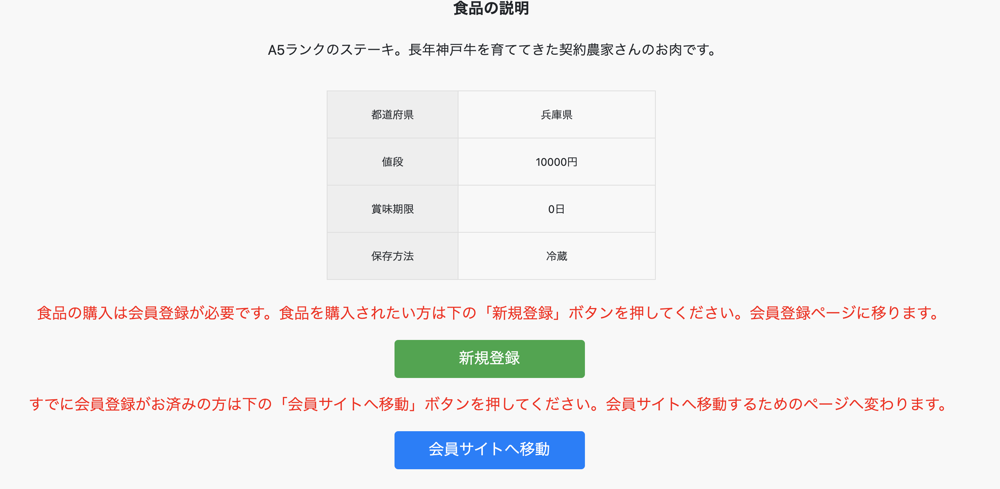

# アプリケーション名
Beginapp21
# 概要
高齢者の方がご当地の食品をインターネットを通して購入するWebアプリケーションです。初めて訪れる方でも操作しやすいページとなっています。
# ペルソナ
60歳以上の男女で英語が苦手な人
# 制作環境（意図）
Webアプリケーションを触る人の中には「自分が操作してどうなるかわからない。」や「変なところを押してしまってパソコンが壊れてしまうのではないか。」という不安からWebアプリケーションを使うのをためらってしまうのが問題です。
操作しやすいWebアプリケーションを作りご当地のおいしい食品をインターネット上で購入してもらうためです。
# 本番環境
URL：https://beginapp21.herokuapp.com 
ログイン情報（テスト用） 
ユーザー１（オーナー） 
&emsp;ニックネーム・・・オーナー  
&emsp;メールアドレス・・a@ya.com  
&emsp;パスワード・・・・w2e2r2    
ユーザー２(購入者) 
&emsp;ニックネーム・・・バイヤー  
&emsp;メールアドレス・・b@ya.com  
&emsp;パスワード・・・・3t3y3u   

# DEMO
### トップページ

購入するためには会員登録が必要だということをページ上部に表示しています。ボタンを押した後何が起こるのか安心させるために説明を入れています。
### 新規登録ページ

ページ遷移が正しく行われているか確認してもらうためにページ上部にページの名称を入れました。 
入力時の注意点をフォームに吹き出しの形で記述しています。
### 食品の詳細ページ

ログイン状態によるページ遷移の場合分け 
オーナー・・・・・・・・・・食品の編集ページへ遷移 
ユーザー（購入者）・・・・・気に入った食品の購入ページへ遷移 
ログアウト状態のユーザー・・ログインページに遷移 
一般の閲覧者・・・・・・・・会員登録ページへ遷移
# 工夫したポイント
読みやすいように文字の大きさを大きくしました。 
操作したらどうなるか分からないというのを安心してもらうため説明する画面構成にしました。 
遷移した先に何のページであるかわかるように表示をつけました。
# 解決したい課題
・スマートフォン表示での表示の歪み
# 今後実装したい機能
・郵便番号APIを使った住所入力の実装 
・Dockerの導入
# 使用環境
## バックグランド
Ruby、Ruby on Rails
## フロントエンド
HTML、CSS、Javascript、Ajax、jQuery(CDN)
## データベース
MySQL
## インフラ
AWS
## ソース管理
GitHub、GitHub Desktop
## テスト
RSpec
## エディタ
VScode
# DB設計

## users テーブル

| Column             | Type   | Options                   |
| ------------------ | ------ | ------------------------- |
| nickname           | string | null: false               |
| email              | string | null: false ,unique :true |
| encrypted_password | string | null: false               |

### Association

- has_many :foods
- has_many :buys

## foods テーブル

| Column        | Type       | Options                      |
| ------------- | ---------  | ---------------------------- |      
| food_name     | string     | null: false                  |
| price         | integer    | null: false                  |
| explanation   | text       | null: false                  |
| area_id       | integer    | null: false                  |
| sell_by       | string     | null: false                  |
| food_hozon_id | integer    | null: false                  |
| user          | references | null: false,foreign_key: true| 

### Association

- belongs_to :user
- has_one :buy

##  buysテーブル

| Column     | Type             |  Options                      |
| ---------- | ----------       | ----------------------------- |
| food       | references       | null: false, foreign_key: true|
| user       | references       | null: false, foreign_key: true|

### Association

- belongs_to :food
- belongs_to :user
- has_one :order

## orders テーブル

| Column        | Type       | Options                       |
| -----------   | ---------- | ----------------------------- |
| myouji        | string     | null: false                   |
| namae         | string     | null: false                   |
| kana_myouji   | string     | null: false                   |
| kana_namae    | string     | null: false                   |
| age           | integer    | null: false                   |
| postal_code   | string     | null: false                   |
| area          | string     | null: false                   |
| city          | string     | null: false                   |
| address       | string     | null: false                   |
| building_name | string     |                               | 
| phone_number  | string     | null: false                   |
| buy           | references | null: false,foreign_key: true |

### Association

- belongs_to :buy
